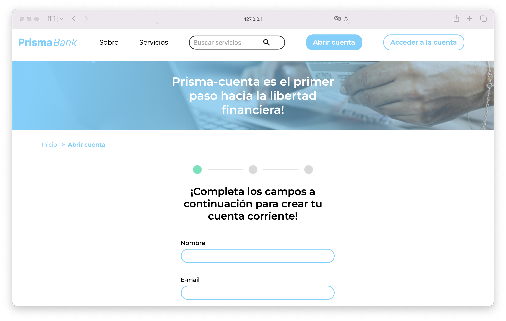

# PrismaBank

**PrismaBank** is a banking platform designed to facilitate the effective and secure creation of checking accounts. The application offers an intuitive interface where users can explore detailed information about available banking services and products.

## Key Features

- **Registration Form**: Allows users to provide necessary information to open a checking account in PrismaBank effectively and securely.
- **Included fields**: name, email address, identification, CUIL/CUIT with specific length and pattern validation, date of birth via an interactive calendar, and a checkbox to accept terms and conditions. Each field is designed to ensure accuracy and validity of entered data, facilitating a smooth and reliable registration process.
- **Facial Recognition**: After completing the initial form, users must capture their facial image to verify their identity. This additional security measure ensures the protection of personal information.
- **Registration Confirmation**: Once the process is completed, users receive confirmation that their account has been successfully created. Additionally, a QR code is generated to facilitate downloading PrismaBank's mobile application for convenient access from any device.

## Demo

Click the image to view the demonstration.

## Tech Stack

**Client:** HTML, CSS, JavaScript

## Prerequisites

- **Visual Studio Code (VSCode)**: You can download it from [Visual Studio Code](https://code.visualstudio.com/).

## Installation Steps

### Download the project:

1. Download the project from the repository or directly as a ZIP file.

### Open the project in Visual Studio Code:

1. Unzip the ZIP file (if you downloaded the project as a ZIP).
2. Open Visual Studio Code.
3. Select `File` > `Open Folder` and navigate to the downloaded project folder.

### Run the application:

1. If you're only using HTML, CSS, and JavaScript, simply open the `index.html` file in your preferred web browser.
2. Alternatively, you can use the Live Server extension in VSCode to run the application locally:
   - Install the **Live Server** extension from the VSCode marketplace.
   - Right-click the `index.html` file and select `Open with Live Server`.

That's it! You should now be able to see and use the **PrismaBank** application in your browser.

## Author

- [@jorgedoiany](https://github.com/jorgedoiany)
